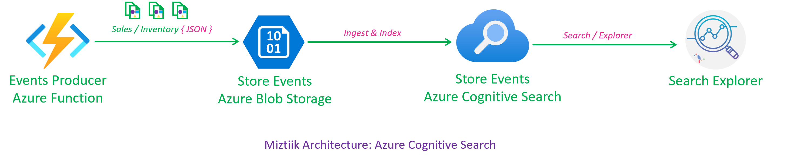

# Index and Search Blob Data using Azure Cognitive Search

Simple demo to create an Azure Cognitive Search service and index data from Azure Blob Storage.

1. Produce the events with azure function.
1. Manually import the data from Azure Blob 1. 1. Storage to Azure Cognitive Search.
1. Create Index and Indexer
1. Search using the explorer.

You can also the index the data from Azure Cosmos as well.

```text
https://logs-ne-search-002.search.windows.net/indexes/store-events-blob-index/docs?api-version=2021-04-30-Preview&search=books
```


